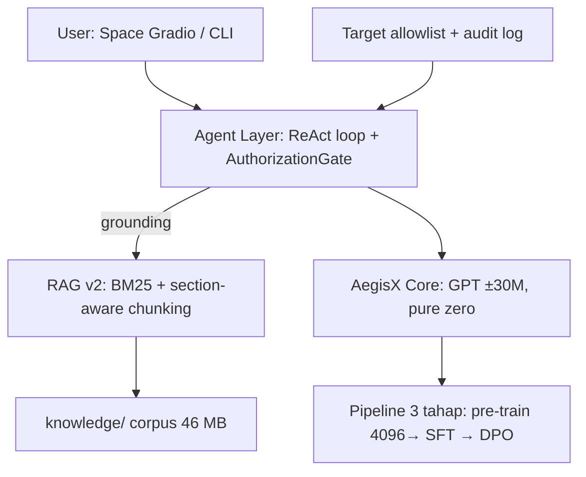

# RFC: AegisX — Model AI Keamanan Siber Pribadi (Pure Zero)

**Status:** Implemented (v0.7) — mengikuti keputusan yang diambil di sesi desain
**Author:** Freebuff (via `@architect` + `@ai-engineer` + `@threat-modeler-stride`)
**Repo:** https://github.com/FerzDevZ/AegisX
**Goal:** Asisten AI pribadi bernama **AegisX**, berbentuk chat seperti
Kimi/GPT/DeepSeek, terspesialisasi keamanan siber (pentest, defense, analisis
teknik serangan, perburuan bug, bug bounty), dwibahasa EN/ID — dilatih **dari
nol (pure zero)**, ringan, gratis, di laptop spesifikasi rendah ("kentang").

> ⚠️ **Perbedaan penting dengan RFC versi awal:** RFC sebelumnya mengusulkan
> fine-tune QLoRA di atas model terbuka (Qwen/Llama) sebagai jalur utama, dan
> from-scratch hanya "Opsi A". Setelah diskusi, **pemilik memilih jalur pure
> zero**: model dilatih dari inisialisasi acak dengan data sendiri, tanpa base
> model pihak ketiga. Dokumen ini mencerminkan arsitektur yang **benar-benar
> diimplementasikan**.

---

## 1. Reality Check (baca dulu)

| Pertanyaan | Fakta |
|---|---|
| Bisa punya model "seperti GPT/Kimi/DeepSeek" yang dilatih dari nol di laptop kentang? | ❌ Untuk skala itu tidak. Training model raksasa butuh ribuan GPU + TB data + jutaan dolar |
| Bisa punya **model milik sendiri**, ringan & enteng, dilatih dari nol? | ✅ **Ya — inilah AegisX-Mini**: ±30M param, GPT-style decoder-only, dilatih di **Colab/Kaggle gratis**, laptop tidak pernah melatih |
| Apa batas jujurnya? | Model skala ini adalah *imitator teks*, bukan penalar penuh. Tanpa RAG & agent layer ia akan menghalusinasi ID CVE/perintah. **RAG grounding + agent ter-gate** adalah kompensasi utamanya |
| Jadi kenapa pure zero, bukan fine-tune Qwen 3B? | Keputusan pemilik: 100% weight & data sendiri (belajar penuh + kepemilikan). Trade-off kapabilitas diterima secara sadar; jalur fine-tune model besar tetap dicatat sebagai opsi masa depan (§11) |

**Kesimpulan:** AegisX-Mini = GPT kecil dari nol + tokenizer BPE sendiri +
**pipeline 3 tahap** (pre-train → SFT → DPO) + **RAG v2** + **agent ReAct
ter-gate**, dilatih di Colab/Kaggle gratis, disajikan di Hugging Face Space.

---

## 2. Arsitektur (yang diimplementasikan)

### Komponen
1. **Core model** — `aegisx/model.py`: GPT decoder-only (config `vocab 8192 ·
   block 768 · n_layer 8 · n_head 8 · n_embd 512`), tied embedding, tanpa bias
   pada LayerNorm/QKV (pola nanoGPT, ratusan baris PyTorch murni).
2. **Tokenizer** — `aegisx/tokenizer.py`: byte-level BPE **tanpa dependensi
   eksternal**, dilatih dari korpus sendiri. Vocab 8.192 cukup efisien untuk
   dwibahasa; byte-fallback menjamin tidak ada token unknown.
3. **Pipeline 3 tahap** — `scripts/pipeline_full.py`:
   `aegisx-mini` (pre-train) → `aegisx-sft` (SFT) → `aegisx-align` (DPO).
4. **RAG** — `aegisx/rag.py`: zero-dependency, BM25 + section-aware chunking.
5. **Agent** — `aegisx/agent_cli.py`: ReAct loop; `aegisx/gate.py` +
   `aegisx/agent.py` membatasi tool pada target ter-allowlist.
6. **Serving** — `hf/space_app.py`: Gradio; int8 di CPU, streaming; ZeroGPU opsional.

---

## 3. Pipeline 3 tahap

| Tahap | Input | Output | Tujuan |
|---|---|---|---|
| **① Pre-train** | `data/raw/` (46 MB, 212 file) | `checkpoints/aegisx-mini/` | Belajar bahasa & pola teks keamanan siber (next-token prediction) |
| **② SFT** | `data/finetune/instructions.jsonl` (1.371, 80% ID) | `checkpoints/aegisx-sft/` | Belajar format tanya-jawab `User:…AegisX:…` → mulai *menjawab* |
| **③ DPO** | `data/finetune/preferences.jsonl` (1.386) | `checkpoints/aegisx-align/` | Belajar preferensi jawaban: mengikuti pengguna, menolak permintaan berbahaya/di luar cakupan dengan sopan |

**Hiperparameter & mekanisme kunci:**
- Pre-train: `batch 16 × grad_accum 4`, `max_steps 1500`, `lr 3e-4` +
  warmup 400, cosine decay; AMP aktif di CUDA (`--no-amp` untuk mati).
- **Early stop** dengan patience + restore bobot terbaik (mencegah overfit).
- **Resume & checkpoint berkala**: `model_latest.pt` tiap N step; saat resume
  LR otomatis diperlembut (anti-catastrophic-forgetting).
- **Auto-arsip**: checkpoint arsitektur lama dipindah ke
  `archive-{vocab}-{block}/` sebelum retrain — tidak pernah crash vocab
  mismatch. Perbandingan arsitektur memakai **struktural** (block/layer/head/
  embd), bukan vocab mentah (BPE byte-fallback membuat vocab aktual ≠ target).
- SFT & DPO: LR kecil terpisah; DPO memakai reference model beku, beta 0.05,
  loss panjang-dinormalisasi.

---

## 4. Data (aset utama)

| Aset | Ukuran | Catatan lisensi |
|---|---|---|
| Korpus mentah `data/raw/` | ±46 MB / 212 file | OWASP (CC BY-SA), MITRE ATT&CK, CVE NVD, HackTricks (CC BY-NC, atribusi), PayloadsAllTheThings, Wikipedia ID, chat ID sendiri |
| Instruksi SFT | 1.371 baris (80.3% ID) | dibuat dari file chat `User:/AegisX:` |
| Preferensi DPO | 1.386 pasangan | chosen/rejected, mayoritas ID |
| Porsi bahasa Indonesia | korpus 2.8% · instruksi 80% | **gap: naikkan korpus ID ke 15–20%** |

Aturan: hanya teks publik berlisensi sah; tanpa data privat; tanpa data target
live. Pipeline fetch: `scripts/fetch_corpus.py`; pembersihan:
`scripts/clean_corpus.py` (termasuk **sanitasi pola secret**); audit bahasa:
`scripts/audit_language.py`.

---

## 5. RAG v2 (jawaban grounded)

Model kecil tidak bisa menghafal detail semua CVE dari bobot — RAG memberi
dokumen untuk dikutip, dan ini kompensasi kapabilitas terbesar setelah data.

1. **Chunking section-aware** per heading markdown; tiap chunk membawa
   breadcrumb 2 level (`§ Bab > Sub-bab`) → kata kunci heading ikut tersimpan.
2. **BM25 asli** (k1=1.5, b=0.75, IDF sesungguhnya).
3. **Rerank**: bonus kata kunci di area heading + diversity antar-sumber.
4. **Ambang skor relatif**: hasil <25% skor terbaik dibuang → konteks bersih.
5. Di Space: `knowledge/` di-build saat start; jawaban menampilkan `📚 Sumber:`.

---

## 6. Agent & keamanan

ReAct loop (rencana → tool → refleksi, max 5 round = circuit breaker).
Semua aksi melewati **AuthorizationGate**:

1. Target allowlist (`targets/authorized.txt`) — di luar daftar = ditolak
2. Audit log berstempel waktu (`logs/audit.log`)
3. Eksekusi aman: tanpa `sudo`, tanpa metakarakter shell, jalan sebagai `argv`
4. `--confirm` → konfirmasi manusia sebelum tool berjalan
5. Sesi SQLite (`--session`/`--resume`) → putus koneksi tidak menghapus konteks

Tool: recon port, web, code search, penulisan laporan — semuanya untuk target
**yang kamu miliki / punya izin tertulis** (bug bounty = in-scope).

---

## 7. STRIDE Security Matrix (platform AegisX sendiri)

| Threat | Risk | Mitigation |
|---|---|---|
| **Spoofing** (orang lain memakai model / prompt injection) | High | Prompt-injection hardening di data (DPO menolak instruksi terselip); guardrail berlapis di peta jalan; akses Space publik tapi read-only |
| **Tampering** (poisoning dataset/model) | High | Sumber data publik berlisensi + sanitasi secret; korpus diverifikasi lewat git; model card menyertakan provenance |
| **Repudiation** (menyangkal aksi) | Med | Audit log lengkap tiap tool call + output |
| **Information Disclosure** (bocor secret / data di luar scope) | High | RAG hanya membaca korpus allow-listed; sanitasi pola secret otomatis di corpus; sistem prompt melarang target non-otorisasi |
| **Denial of Service** (overload model) | Low | Single-user; Space gratis CPU; batas max tokens |
| **Elevation of Privilege** (agent lolos sandbox) | High | Gate: allowlist + no-sudo + argv-only; tool berjalan unprivileged |

---

## 8. Lingkungan training & hosting

| Sumber daya | Detail |
|---|---|
| **Training** | Google Colab (T4 16 GB gratis) atau Kaggle GPU. Tokenizer ±30–90 mnt (sekali per vocab); training 1500 step ±1–1,5 jam; SFT ±15–20 mnt; DPO ±10 mnt |
| **Penyimpanan** | Google Drive (`MyDrive/aegisx/checkpoints/…`) — hasil survive sesi putus |
| **Hosting** | Hugging Face Space CPU gratis: int8 dynamic quantization (2–3× lebih cepat, memori ~4× lebih kecil) + streaming token; ZeroGPU = fp32 one-shot |
| **Model Hub** | Opsional: simpan bobot di Hub, Space membaca lewat env `AEGISX_REPO` |

Upload selalu **manual** (tidak ada auto-push) — pemilik memeriksa hasil dulu.

---

## 9. Metrik & evaluasi

- `aegisx/eval.py`: 20 soal tetap (10 EN + 10 ID), skor keyword-coverage,
  `--history` CSV untuk membandingkan antar-run.
- Run terbaik arsitektur lama: val loss **2.4387** (perplexity ≈ 11.5), jarak
  train/val sehat — dari korpus 8,2M token. Arsitektur baru (8192/768, 46 MB)
  adalah tolok ukur berjalan.
- **Target berikutnya:** suite 100+ soal (50 ID + 50 EN, multi-turn) + laporan
  HTML per run sebagai gate sebelum upload.

---

## 10. Roadmap & status

| Fase | Status |
|---|---|
| Tokenizer + model + training CPU + chat + gate | ✅ v0.1 |
| Colab T4 (AMP, resume, early-stop) + export manual → Space live | ✅ v0.2 |
| RAG v1 → v2 (BM25 + section-aware) + `knowledge/` di export | ✅ v0.3 |
| Agent ↔ model: ReAct + `--confirm` + sesi SQLite | ✅ v0.4 |
| Pure-zero SFT (1.371 instruksi) | ✅ v0.5 |
| Tahap-3 DPO (1.386 preferensi) + pipeline 1-tombol | ✅ v0.6 |
| Korpus 46 MB · vocab 8192/block 768 · int8 + streaming Space | ✅ v0.7 |
| Retrain bersih arsitektur baru di T4 · korpus ID → 15–20% · eval 100 soal · guardrails berlapis | 🔜 v0.8–v1.0 |

---

## 11. Alternatif masa depan (bila ingin kapabilitas lebih)

Bila suatu saat pemilik menginginkan penalaran setara model besar, jalur yang
tetap kompatibel dengan aset ini: **fine-tune model terbuka** (mis. Qwen2.5-3B
via QLoRA/Unsloth, notebook `aegisx_finetune_colab.ipynb`) di atas **korpus
yang sama**. Korpus, dataset instruksi, preferensi, RAG, agent, dan Space app
semuanya bisa dipakai ulang — hanya "otak"-nya yang berganti. Ini bukan
curang; ini cara industri bekerja. Keputusan tetap di pemilik.

---

## 12. Batas & etika

- Model skala ±30M **belum layak** untuk keputusan keamanan produksi tanpa
  review manusia; ia bisa menghalusinasi ID CVE/perintah.
- Gunakan **hanya** untuk sistem yang kamu miliki atau diizinkan menguji.
- Model menolak permintaan berbahaya/off-scope (diajarkan di tahap DPO) — jika
  masih lolos, laporkan sebagai temuan red-team untuk data preferensi baru.

*Dokumen ini hidup — perbarui tiap milestone (Rel4).*
