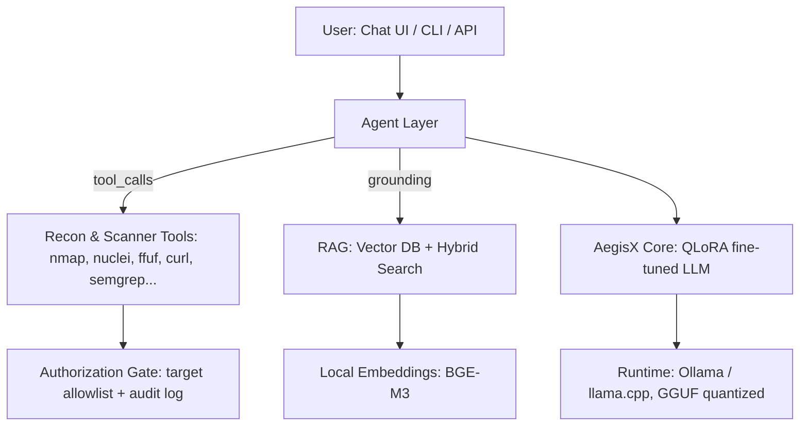
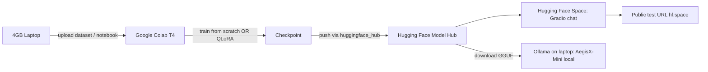

# RFC: AegisX — Personal Cybersecurity AI Model

**Status:** Draft v1.0
**Author:** Freebuff Superpower Ultra (via `@architect` + `@ai-engineer` + `@threat-modeler-stride`)
**Goal:** A personal AI assistant named **AegisX**, chat-shaped like Kimi/GPT/DeepSeek, specialized for cybersecurity: pentesting, defense, attack technique analysis, bug hunting, and bug bounty support. Runs on a low-spec ("potato") laptop.

---

## 1. Reality Check (read this first)

| What you want | What is physically possible on a potato laptop |
|---|---|
| Train a model from scratch like GPT-4 / DeepSeek | ❌ Impossible — requires thousands of GPUs, TBs of data, millions of $ |
| Own a personal AI model "like the big ones" | ✅ Fine-tune an open-weights model (Qwen, Llama, Mistral) → it becomes **your** model, specialized for cysec |
| Full-power pentest/bug-bounty assistant | ✅ Fine-tuned model + RAG knowledge base + agentic tool layer |

**Conclusion:** AegisX = open-weights base model, fine-tuned with **QLoRA** on a curated cybersecurity dataset, served locally via **Ollama**, augmented with a **RAG** knowledge base and an **agent tool layer** for recon/scanning. This is exactly how real teams ship "their own" specialized models.

---

## 2. High-Level Architecture

### Components
1. **Runtime (bottom layer)** — Ollama serving a GGUF-quantized model; OpenAI-compatible API so any chat UI can talk to AegisX.
2. **AegisX Core** — the fine-tuned model (base + LoRA merged), specialized in cysec knowledge and tool usage.
3. **RAG Knowledge Base** — CVE data, OWASP guides, pentest playbooks, bug-bounty writeups, retrieved on demand to ground answers and reduce hallucination.
4. **Agent Layer** — lets AegisX *do* things: run recon/scan tools, search code, query the KB.
5. **Authorization Gate** — every offensive action requires an explicitly allow-listed target. Non-negotiable.

---

## 3. Hardware Tiers (pick yours)

| Tier | Hardware | Base model | What you get |
|---|---|---|---|
| **P0 (potato)** | 8 GB RAM, no GPU | Qwen2.5-3B-Instruct or Llama-3.2-3B, Q4_K_M (~2.5 GB) | Chat + RAG + basic agent tools. Fine-tuning done on free Google Colab, not locally |
| **P1 (decent)** | 16 GB RAM, no GPU | Qwen2.5-7B-Instruct, Q4_K_M (~5 GB) | Stronger reasoning, bigger KB, QLoRA fine-tune possible on CPU (slow) or Colab |
| **P2 (gaming)** | NVIDIA GPU 6 GB+ VRAM | Qwen2.5-7B / 14B + QLoRA | Fast local fine-tuning with Unsloth, near-full power |

> Unknown yet: your exact RAM/GPU. This is the one variable that changes the base-model choice.

---

## 4. Dataset Plan (what makes AegisX "cysec")

Fine-tuning a specialty model is ~90% dataset quality. Target **5,000–20,000 high-quality instruction samples** in ChatML format (`<|im_start|>user / assistant`).

| Domain | Sources | Example topics |
|---|---|---|
| **Offensive / Pentest** | OWASP WSTG, PortSwigger labs, PTES methodology | Recon, exploitation, privilege escalation, tool usage (nmap, nuclei, sqlmap, ffuf) |
| **Defensive** | OWASP Top 10, hardening guides, CIS benchmarks | Detection, hardening, incident response, log analysis, secure coding |
| **Bug bounty** | Publicly disclosed HackerOne/Intigriti reports (sanitized) | How to read a program scope, write a report, triage a finding |
| **Vulnerability intel** | CVE descriptions, exploit-db writeups | Explain CVE, assess severity, suggest mitigation |
| **Tool skill** | Man pages + usage examples | "How do I run nuclei with -severity high against this target?" |

Rules: no proprietary/violating content, no live target data; everything from public training sources or synthetic generation. Quality over quantity.

---

## 5. Training Pipeline (QLoRA)

1. **Where:** Free Google Colab (T4 GPU) if no local GPU — your laptop never breaks a sweat; you just download the finished LoRA.
2. **Tooling:** Unsloth (4x faster, minimal VRAM) or `peft` + `bitsandbytes`.
3. **Hyperparameters (proven defaults):** 4-bit NF4 quantization, `lora_r=16`, `lora_alpha=32`, `lr=2e-4`, 3 epochs, `max_seq_len=2048–4096`, packing on.
4. **Output:** Merge LoRA into base → export to GGUF (Q4_K_M) → import into Ollama as a new model named `aegisx`.

---

## 6. RAG Pipeline

- **Corpus:** CVE dataset (subset), OWASP docs, pentest playbooks, tool cheatsheets.
- **Chunking:** recursive markdown / semantic chunking with title+section metadata prepended.
- **Embeddings:** local BGE-M3 (no cloud API — stays private on the potato).
- **Vector DB:** Chroma (P0) or Qdrant (P1+).
- **Search:** hybrid BM25 + dense with Reciprocal Rank Fusion, then a cross-encoder reranker, top-5 into context with citations.

---

## 7. Agent Tool Layer ("Full Power")

Expose OpenAI-compatible **tool calling** (Ollama supports it):

- `recon` — nmap, subfinder, nuclei (template-based scanning)
- `web` — ffuf fuzzing, curl requests
- `code_search` — ripgrep, semgrep SAST scans
- `kb` — RAG query
- `write_report` — generates a bug-bounty report draft

**Authorization Gate (mandatory):**
- Targets must be pre-registered in an allowlist (files like `targets/authorized.txt`).
- Every tool invocation is logged (timestamp, command, target).
- No sudo, no lateral movement, no actions outside the allowlist.
- System prompt states the rule; the gate enforces it at runtime.

This is both the ethical and legal boundary — bug bounty only ever targets in-scope, authorized programs.

---

## 8. STRIDE Security Matrix (AegisX platform itself)

| Threat | Risk | Mitigation |
|---|---|---|
| **Spoofing** (someone else uses your model / prompt injection) | High | API-key auth on the server; prompt-injection hardening; refuse to follow injected instructions in tool results |
| **Tampering** (dataset/model poisoning) | High | Pin dataset hashes, provenance tracking, re-verify LoRA checksum on import |
| **Repudiation** (deny actions taken) | Medium | Full audit log of every tool call + model output |
| **Information Disclosure** (leak secrets / out-of-scope data) | High | Local-first (nothing leaves laptop); RAG only returns allow-listed corpus; secret-scanning on outputs |
| **Denial of Service** (model overload) | Low | Local single-user; simple rate limit on API |
| **Elevation of Privilege** (agent escapes sandbox) | High | Tools run unprivileged, in a container; allowlist enforcement; no `--privileged` |

---

## 9. Roadmap

| Phase | Deliverable | Time (est.) |
|---|---|---|
| **0. Setup** | Install Ollama, confirm hardware tier, benchmark tokens/sec | 1 day |
| **1. Base chat** | AegisX answering cysec questions on the base model | Day 1–2 |
| **2. RAG** | Vector DB + hybrid search working; grounded answers | Day 3–5 |
| **3. Fine-tune** | Dataset built → QLoRA on Colab → `aegisx` model in Ollama | Week 2 |
| **4. Agent layer** | Tool calling + authorization gate + audit log | Week 3 |
| **5. Eval & harden** | Cyseceval-style benchmark, red-team the model, fix weak spots | Week 4 |

---

## 10. Option A: Pure From-Scratch (AegisX-Mini) — "ringan & enteng"

If you want a model **trained from zero on your own laptop**, that is genuinely possible — you just have to accept what scale buys you.

| | Fine-tune (main plan) | Pure from-scratch (this option) |
|---|---|---|
| **What you train** | LoRA adapter on top of Qwen/Llama | Full weights from random init |
| **Hardware** | Colab or any GPU | **CPU-only is fine** (potato-friendly) |
| **Model size** | 3B–8B params | **4M–50M params** (file: 15–200 MB) |
| **Training data** | 5k–20k curated Q&A | Raw cysec text corpus (20–200 MB) |
| **Training time** | hours (GPU) | hours–days on CPU |
| **Result** | Real assistant: answers, tool use | A model that *imitates* cysec text, autocompletes commands/code, generates plausible writeup-style text |
| **Can it do bug bounty?** | Yes (with RAG + tools) | **No** — it pattern-matches; it will hallucinate CVE IDs and commands. Useful only as a demo/learning model or autocomplete |

### From-scratch stack (all CPU-friendly, all free)
1. **Architecture:** GPT-style decoder-only transformer, ~4–50M params (Karpathy `nanoGPT` pattern — a few hundred lines of PyTorch, well-documented, runs on CPU).
2. **Tokenizer:** train a small BPE (vocab 4k–8k) on your cysec corpus, or char-level for the absolute minimum.
3. **Dataset:** 20–200 MB of public cysec text (OWASP docs, man pages, CVE descriptions, sanitized writeups).
4. **Training:** plain PyTorch on CPU. A 10M-param model over ~50M tokens ≈ a few hours (demo quality) to a few days (decent imitation).
5. **Serving:** export to GGUF, run in Ollama — a 10M-param model generates instantly on any laptop.

### The honest tradeoff
A pure-from-scratch model on a potato will be **AegisX-Mini**: lightweight, fully yours, trains entirely on your laptop — but it is a *text imitator*, not an assistant. It cannot reason about a pentest target, plan an exploit chain, or answer "how do I scan X" correctly. Every real "own model" (even small ones) starts from an open base for capability; that's not cheating, it's how the industry works.

**Recommended hybrid:** build AegisX-Mini from scratch first (fun, educational, satisfies "pure from zero"), and keep the fine-tuned AegisX for real bug-bounty work. Same laptop, both models in Ollama.

---

## 11. Training Environment: Google Colab (free T4) + Hosting: Hugging Face

Your chosen pipeline: **train/tune on Google Colab, host on Hugging Face.** This is a perfect fit for a 4 GB laptop — the laptop becomes a thin client; Colab does the compute, HF serves the model.

### Google Colab (training)

| Resource | Free tier | Enough for? |
|---|---|---|
| GPU | NVIDIA T4 (16 GB VRAM) | From-scratch AegisX-Mini (4–50M params): **minutes–hours** |
| | | QLoRA fine-tune of Qwen 3B: a few hours |
| RAM | ~12 GB | Fine for both paths |
| Disk | ~78 GB | Plenty for datasets + checkpoints |
| Limits | Session timeout + daily usage cap | Save checkpoints to Google Drive/HF Hub to survive disconnects |

**Colab workflow:** a single notebook does: dataset build → train (from scratch OR QLoRA) → evaluate → export → **push weights straight to Hugging Face Hub** (`huggingface_hub` API). Nothing touches your laptop except the final download.

### Hugging Face (hosting)

| Option | Cost | Fit for AegisX |
|---|---|---|
| **Model Hub** | Free | Store AegisX-Mini weights + model card; the canonical artifact |
| **Spaces + Gradio** | Free CPU tier (2 vCPU / 16 GB RAM) | Serve AegisX-Mini behind a chat UI with a public URL — perfect for testing |
| **Serverless Inference** | Free-ish for small models | API calls without running a server |
| **Inference Endpoints** | Paid, GPU-backed | Only if you later need production-grade serving of the fine-tuned model |

**Recommended setup:** push weights to the Hub → create a CPU **Space** running a Gradio chat app that loads the model from the Hub → you get a public `hf.space` link to share and test. Because AegisX-Mini is only 15–200 MB, the free CPU tier handles it easily. (If you later fine-tune Qwen 3B, the free CPU Space will be too slow — that's when you'd use paid Endpoints or run it locally.)

### End-to-end flow

---

## 12. Open Decisions (need your input)

1. **Hardware:** RAM amount? Any NVIDIA GPU? → determines P0/P1/P2.
2. **Fine-tune location:** Local (if GPU) vs free Colab (recommended for potato).
3. **Interface:** CLI first, web chat UI later, or both?
4. **Scope of "attack":** read-only recon + scanning, or also exploit execution (authorized targets only)?